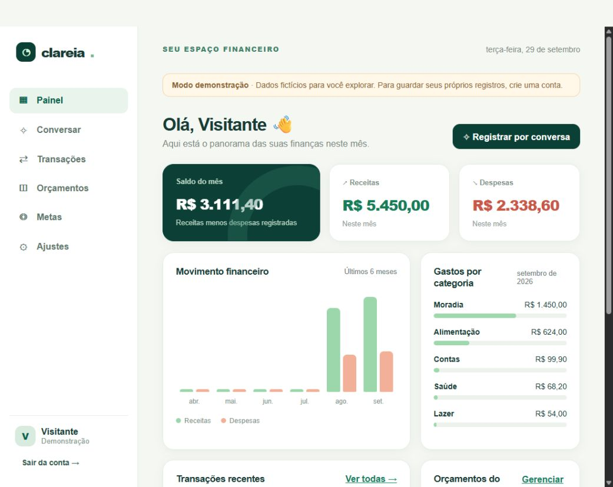
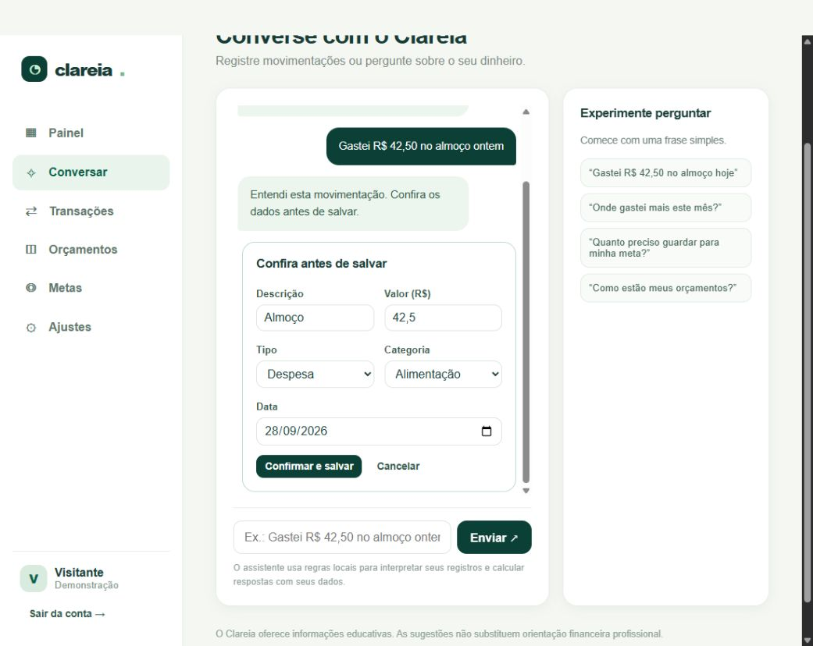
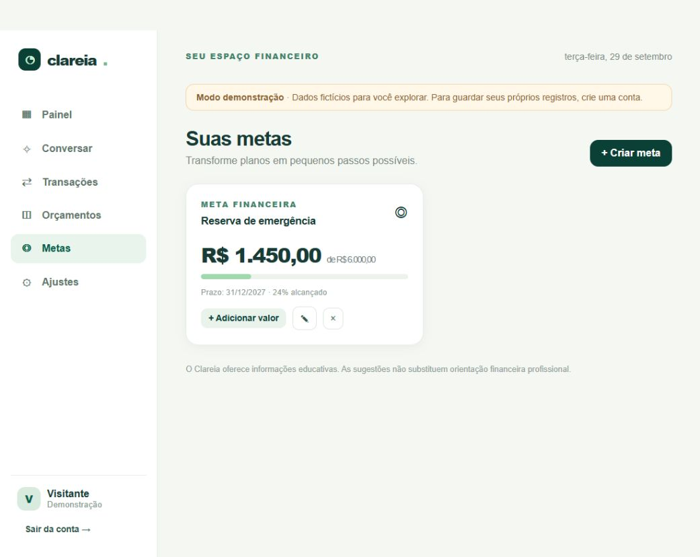
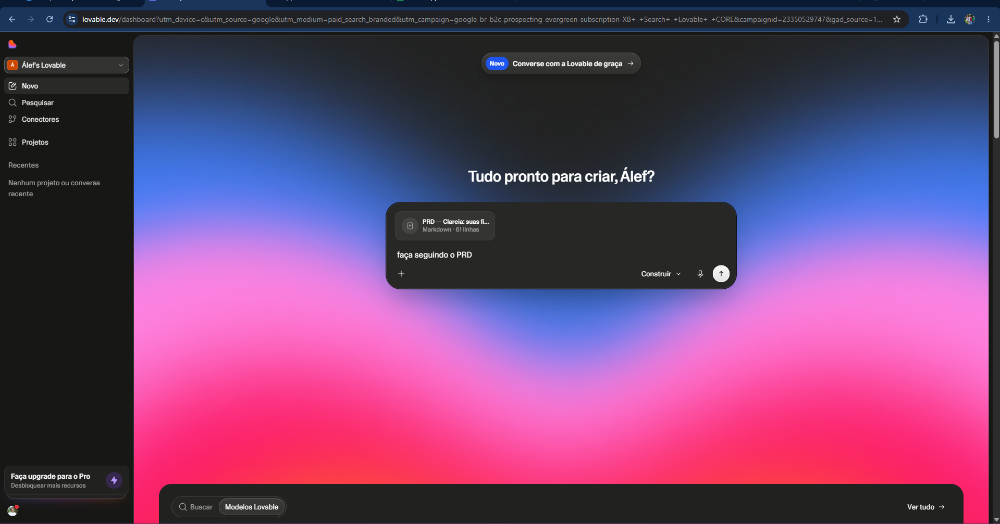
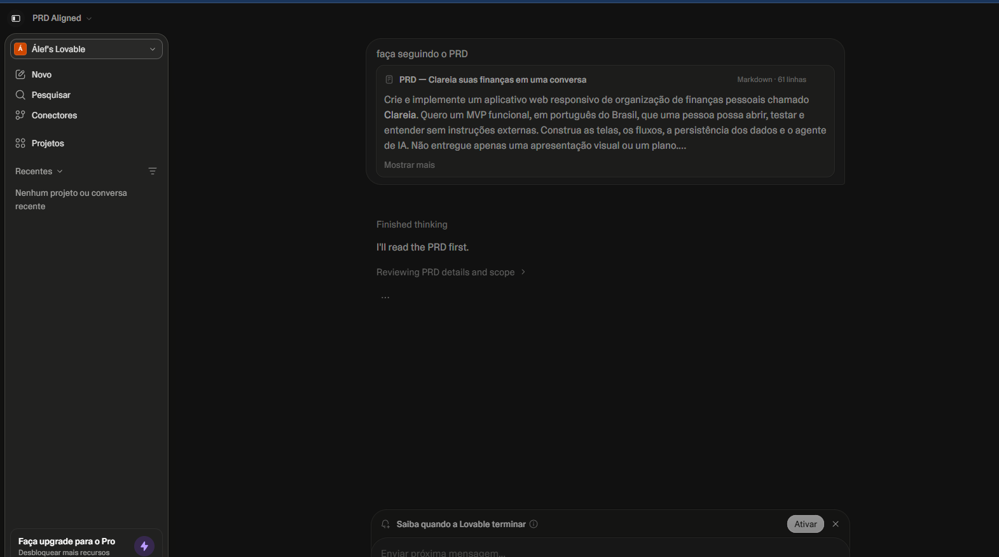

# Clareia — suas finanças em uma conversa

> Projeto para o desafio [App de Organização de Finanças Pessoais com Vibe Coding](https://github.com/digitalinnovationone/dio-lab-vibe-coding-app-financas), da DIO.

O **Clareia** ajuda quem está começando a organizar o dinheiro. A pessoa registra uma movimentação por conversa, confirma os dados interpretados, acompanha despesas e receitas, cria orçamentos e avança em metas financeiras. A interface é responsiva e está em português do Brasil.

## Experimente

Depois de iniciar o projeto, escolha **Experimentar demonstração**. Os valores exibidos são fictícios, mas as ações funcionam: você pode registrar, editar e excluir transações, criar limites e metas e fazer perguntas ao assistente.



## Funcionalidades implementadas

- Cadastro, login e logout com senha protegida por `scrypt`.
- Dados persistidos no servidor e separados por conta.
- Registro por conversa com interpretação de valor, data, tipo e categoria, sempre com confirmação antes de salvar.
- Respostas calculadas sobre saldo, categorias, orçamentos e metas.
- Criação, edição, exclusão e filtros de transações.
- Orçamentos por categoria e mês, com alerta visual de limite.
- Metas com prazo, progresso e contribuições.
- Demonstração com dados fictícios e layout adaptado para celular.
- Integração opcional com a [Responses API da OpenAI](https://developers.openai.com/api/docs/guides/text) para respostas em linguagem natural. A chave fica apenas no servidor, e o usuário precisa ativar o uso da IA na conversa. Sem chave ou sem ativação, o assistente usa regras e cálculos locais. **A integração externa não foi testada com uma chave real neste projeto.**

### Telas do aplicativo

| Conversa e confirmação | Metas | Versão para celular |
| --- | --- | --- |
|  |  |  |

## PRD: prompt final

Este foi o briefing preparado para guiar a IA. O [prompt integral enviado ao Lovable](docs/PRD.md) está preservado no projeto. A tentativa no Lovable está documentada logo abaixo; a implementação final do código foi concluída com o Codex depois que os créditos do Lovable se esgotaram. Abaixo está sua versão organizada para leitura rápida.

<details>
<summary>Abrir prompt completo</summary>

### Contexto e problema

Crie e implemente um aplicativo web responsivo de organização de finanças pessoais chamado **Clareia**. Quero um MVP funcional, em português do Brasil, que uma pessoa possa abrir, testar e entender sem instruções externas. Construa as telas, os fluxos, a persistência dos dados e o agente de IA. Não entregue apenas uma apresentação visual ou um plano.

Muitas pessoas desistem de controlar o dinheiro porque precisam preencher formulários, escolher categorias e interpretar gráficos complexos. O Clareia deve tornar esse processo mais simples: a pessoa conta o que aconteceu em linguagem natural, acompanha seus gastos e recebe orientações claras para atingir uma meta.

### Público-alvo e proposta de valor

Pessoas iniciantes em organização financeira, especialmente quem quer acompanhar receitas e despesas do mês sem usar planilhas. Proposta de valor: **“Entenda para onde seu dinheiro vai e descubra o próximo passo, uma conversa de cada vez.”**

### Funcionalidades do MVP

1. **Registro por conversa:** entender frases como “Gastei R$ 42,50 no almoço ontem” ou “Recebi R$ 3.200 de salário hoje”. Identificar tipo, valor, descrição, categoria e data. Antes de salvar, mostrar os dados para confirmação ou correção.
2. **Transações:** criar, consultar, editar e excluir receitas e despesas. Filtrar por mês, tipo e categoria. Atualizar totais e gráficos após cada alteração.
3. **Classificação inteligente:** sugerir categoria e permitir correção pelo usuário.
4. **Orçamentos mensais:** definir limite por categoria; mostrar quanto foi usado, quanto resta e se o limite foi ultrapassado.
5. **Metas financeiras:** criar meta com nome, valor desejado e prazo; registrar contribuições e acompanhar progresso.
6. **Agente financeiro:** responder perguntas como “Onde gastei mais este mês?” e “Quanto preciso guardar por mês para minha meta?”. Usar somente dados do usuário, explicar contas de modo simples e oferecer sugestões práticas.
7. **Painel:** mostrar saldo do período, receitas, despesas, gastos por categoria, evolução mensal, orçamentos e metas, com gráficos legíveis no celular.

### Telas e fluxo

- Página inicial com explicação do produto, demonstração e criação de conta.
- Demonstração com dados fictícios, sem mistura com contas reais.
- Cadastro e login por e-mail.
- Painel com resumo e acesso direto ao chat.
- Conversa com histórico, perguntas sugeridas e confirmação de transações.
- Transações com busca, filtros e edição.
- Orçamentos e metas com criação, acompanhamento e edição.
- Ajustes com informações da conta, privacidade e uso da IA.

### Dados, segurança e comportamento do agente

Cada usuário deve acessar somente os próprios dados. Credenciais de IA nunca devem ser expostas no navegador. Não pedir conexão bancária nem dados financeiros reais para experimentar a demonstração. O agente deve falar de forma acolhedora e sem julgamento, não inventar números, dizer quando faltarem informações e pedir confirmação antes de alterar dados. Diferenciar fatos calculados de sugestões gerais e incluir aviso de caráter educativo.

### Direção visual

Identidade moderna e confiável: fundo claro, verde profundo, detalhes em menta e coral, boa hierarquia tipográfica e espaço entre elementos. Evitar a aparência de um painel bancário genérico. Priorizar contraste, rótulos, teclado, mensagens claras e gráficos acompanhados de valores em texto.

### Critérios de aceite

- Demonstração navegável com dados fictícios e principais fluxos.
- Cadastro, login e logout funcionais.
- Transação por conversa salva somente após confirmação e atualiza o painel.
- Edição e exclusão atualizam os totais.
- Orçamentos e metas persistem por usuário.
- Respostas do agente usam apenas dados da conta.
- Telas principais funcionam em celular e computador.
- Sem botões decorativos, links quebrados ou dados fixos apresentados como pessoais.

**Instrução final:** implemente o aplicativo, teste os fluxos, corrija erros e entregue um resumo do que foi feito e das limitações reais.

</details>

## Interações com a IA

O prompt foi enviado ao Lovable, que começou a analisar o PRD. Os créditos disponíveis terminaram antes da construção do aplicativo. Estes prints são da tentativa real, fornecidos pelo autor do projeto:

| Prompt preparado no Lovable | Análise iniciada pelo Lovable |
| --- | --- |
|  |  |

Na sequência, o mesmo PRD orientou a implementação do app com o **Codex**. As capturas das telas acima mostram o resultado executado e testado. Elas não são apresentadas como telas geradas pelo Lovable.

## Como executar

Requer **Node.js 20 ou superior**. Não há dependências externas para instalar.

```bash
node server.js
```

Acesse `http://localhost:3000` no navegador. Para executar os testes:

```bash
npm test
```

Os dados são armazenados na pasta local `.data/`, ignorada pelo Git. Como os créditos do Lovable acabaram, a implementação usa um servidor Node.js no lugar do Lovable Cloud previsto no PRD. Para hospedar publicamente com contas reais, use um serviço que execute Node.js, HTTPS e armazenamento persistente; configure `NODE_ENV=production` para marcar o cookie de sessão como seguro. O repositório público contém o código, não os registros criados por usuários.

### IA opcional

Para permitir respostas de um modelo de linguagem, configure `OPENAI_API_KEY` no ambiente do servidor. Você pode escolher o modelo com `OPENAI_MODEL` (padrão: `gpt-5.6-terra`). O usuário ainda precisa marcar **Usar IA** na conversa. Somente a pergunta e os totais agregados do mês, orçamentos e metas são enviados à API. O registro de transações e os cálculos básicos continuam locais.

## Validação e limites

Foram verificados o cadastro, isolamento entre contas, registro por conversa antes e depois da confirmação, persistência, orçamentos, metas e acesso negado após logout por teste automatizado. Também foram percorridas no navegador as telas de demonstração, conversa, transações, orçamentos e metas, com conferência do layout no celular. A chamada externa de IA depende de uma chave e não foi exercitada; o app continua útil sem ela. A sessão de login fica na memória do servidor e é encerrada quando ele reinicia.

## Reflexão sobre o processo

O que funcionou melhor foi transformar uma ideia ampla em critérios observáveis: “registrar por conversa” passou a significar interpretar, mostrar uma prévia, confirmar e só então salvar. Isso deixou o app mais fácil de construir e de testar. O Lovable iniciou a análise do PRD, mas o limite de créditos impediu a conclusão ali. A principal lição foi manter o prompt claro e registrar a diferença entre a intenção inicial, o que a ferramenta realmente produziu e o que foi implementado depois. A colaboração com IA acelerou a estruturação do produto, enquanto a revisão humana continuou necessária para conferir segurança, cálculos e experiência de uso.

---

**Aviso:** o Clareia é um projeto educacional. Não oferece aconselhamento financeiro profissional nem integração bancária.
